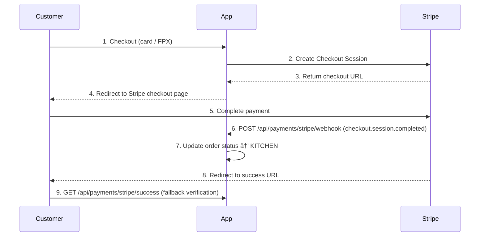

# Stripe Webhook Setup — Digital Menu System

This document explains how Stripe webhooks work in this application and how to
configure them for **local development** and **production**.

---

## How Webhooks Work in This App



**Key endpoints:**

| Endpoint | Purpose |
|---|---|
| `POST /api/payments/stripe/checkout-session` | Creates an order and a Stripe Checkout session |
| `POST /api/payments/stripe/webhook` | **Webhook** — Stripe notifies us when payment succeeds |
| `GET /api/payments/stripe/success` | Fallback after user returns from Stripe (double-checks payment) |
| `GET /api/payments/stripe/cancel` | Redirect when user cancels payment |

The **webhook is the primary mechanism** that confirms payment. The success URL
acts as a fallback so local dev works even without the Stripe CLI running.

---

## 1. Local Development (Stripe CLI)

### 1.1 Install Stripe CLI
```bash
# Windows (with Scoop)
scoop install stripe

# Windows (manual)
# Download from: https://stripe.com/docs/stripe-cli

# macOS
brew install stripe/stripe-cli/stripe
```

### 1.2 Login to Stripe
```bash
stripe login
# This opens your browser — log in to your Stripe Dashboard.
```

### 1.3 Start the App
```bash
cd menumanager
mvn spring-boot:run
```

### 1.4 Forward Webhooks to Your Local App
```bash
stripe listen --forward-to localhost:8080/api/payments/stripe/webhook

# You will see output like:
# > Your webhook signing secret is whsec_abc123...
```

### 1.5 Set the Webhook Secret
Copy the signing secret (starts with `whsec_`) from the CLI output
and set it as your `STRIPE_WEBHOOK_SECRET` environment variable:

**Option A — .env file (recommended for local):**
```bash
# In your .env file at the repo root:
STRIPE_WEBHOOK_SECRET=whsec_abc123...
STRIPE_SECRET_KEY=sk_test_...
```

**Option B — Command-line (current session only):**
```bash
# Windows CMD
set STRIPE_WEBHOOK_SECRET=whsec_abc123...
set STRIPE_SECRET_KEY=sk_test_...

# Windows PowerShell
$env:STRIPE_WEBHOOK_SECRET="whsec_abc123..."
$env:STRIPE_SECRET_KEY="sk_test_..."

# macOS / Linux
export STRIPE_WEBHOOK_SECRET=whsec_abc123...
export STRIPE_SECRET_KEY=sk_test_...
```

### 1.6 Test the Webhook
Keep the Stripe CLI running, then trigger a test event:
```bash
# In another terminal, trigger a test checkout.session.completed event
stripe trigger checkout.session.completed
```

Check your app logs — you should see the webhook being received.
The app returns `200 OK` with body `"ok"` on success.

### 1.7 Run Full Checkout Flow Locally
1. Start the app (step 1.3)
2. Start Stripe CLI forwarding (step 1.4)
3. Open http://localhost:8080/customer
4. Add items to cart and choose **Card** or **Online Banking (FPX)**
5. On the Stripe checkout page, use card number `4242 4242 4242 4242` with any future date and CVC
6. After payment, you should be redirected back — order status is now **KITCHEN**

---

## 2. Production Setup

### 2.1 Deploy to Production
Follow the deployment steps in [README.md](README.md).
Ensure your app is running at a public URL

### 2.2 Create Webhook Endpoint in Stripe Dashboard

1. Go to **Stripe Dashboard** → [**Developers** → **Webhooks**](https://dashboard.stripe.com/webhooks)
2. Click **Add endpoint**
3. Configure:

   | Field | Value |
   |---|---|
   | **Endpoint URL** | `https://your-app.your production environment.app/api/payments/stripe/webhook` |
   | **Version** | Your API version (default is fine) |
   | **Events to listen** | Select `checkout.session.completed` |
   | **Connect** | Leave unchecked (or enable if using Stripe Connect) |
   | **Description** | `Digital Menu System — payment confirmation` |

4. Click **Add endpoint**

### 2.3 Get the Signing Secret
1. After creating the endpoint, click on it to open the details
2. Under **Signing secret**, click **Reveal**
3. Copy the value (starts with `whsec_`)

### 2.4 Set Environment Variables in your production environment
In **your production environment Dashboard** → Your Service → **Variables**, add:

```
STRIPE_WEBHOOK_SECRET=whsec_your_signing_secret_here
STRIPE_SECRET_KEY=sk_live_or_sk_test_your_key_here
PUBLIC_BASE_URL=https://your-app.your production environment.app
```

> **Warning:** Never commit these values to Git. They are set only in your production environment.

### 2.5 Verify the Webhook Works
In Stripe Dashboard → Webhooks → your endpoint → **Send test webhook**
- Select `checkout.session.completed`
- Click **Send test webhook**
- You should see **HTTP 200 OK** with body `"ok"`

---

## 3. Webhook Code Reference

The webhook handler is in `PaymentController.java` (lines 235–271):

```java
@StripeWebhook
public ResponseEntity<String> stripeWebhook(
        @RequestBody String payload,
        @RequestHeader(name = "Stripe-Signature") String sigHeader
) {
    // 1. Verify signature
    Event event = Webhook.constructEvent(payload, sigHeader, stripeWebhookSecret);

    // 2. Handle checkout.session.completed
    if ("checkout.session.completed".equals(event.getType())) {
        String orderId = session.getMetadata().get("orderId");
        orderService.updateOrderStatus(orderId, "KITCHEN");
    }

    return ResponseEntity.ok("ok");
}
`

**What the webhook does when called:**

1. **Verifies** the request using the Stripe-Signature header and your signing secret
2. **Parses** the Event object from the payload
3. **Checks** if the event type is checkout.session.completed
4. **Extracts** orderId from session.metadata (set when the checkout session was created)
5. **Updates** the order:
   - Sets stripeSessionId to the Stripe Checkout session ID
   - Sets stripePaymentIntentId to the PaymentIntent ID
   - Sets paidAt to the current timestamp
   - Changes status to KITCHEN

---

## 4. Security Best Practices

### ? Always Verify the Signature

The webhook handler **rejects unsigned requests**. If STRIPE_WEBHOOK_SECRET is not set,
the endpoint returns 400 Bad Request — "Webhook secret not configured".

### ? Never Accept Webhooks Without HTTPS in Production

Stripe only sends webhooks to HTTPS endpoints in production. For local dev, HTTP is fine
since Stripe CLI forwards via a tunnel.

### ? Use Environment Variables

- STRIPE_SECRET_KEY — set only in your production environment, never in code
- STRIPE_WEBHOOK_SECRET — set only in your production environment, never in code
- Both are excluded from Git via .gitignore

### ? What Not to Do

- Do **not** hardcode the webhook secret in pplication.properties
- Do **not** disable signature verification (
equired = false on Stripe-Signature)
- Do **not** log the webhook secret in app logs

---

## 5. Troubleshooting

| Problem | Likely Cause | Fix |
|---|---|---|
| 400 Invalid signature | Wrong or missing STRIPE_WEBHOOK_SECRET | Check the signing secret in your production environment matches the one in Stripe Dashboard |
| 400 Webhook secret not configured | STRIPE_WEBHOOK_SECRET env var is empty | Set it in your production environment Dashboard and redeploy |
| Order stays ONLINE_PAYMENT_PENDING after payment | Webhook not reaching your app | Check Stripe Dashboard ? Webhooks ? Latest attempts for error details |
| 500 Webhook error | Exception in handler code | Check app logs for the stack trace |
| Success redirect works but webhook doesn't | Stripe Dashboard URL is wrong | Ensure the endpoint URL matches exactly, including the trailing path |
| FPX payment never completes | FPX requires real-time bank transfer | Test with card first (4242...), then try FPX with a real test bank |

### Check Webhook Delivery Logs

1. Stripe Dashboard ? **Developers** ? **Webhooks**
2. Click your endpoint
3. Scroll to **Webhook attempts** — you'll see every delivery attempt with status code and response body

### Redeploy After Changing Env Vars

In your production environment, after adding/updating STRIPE_WEBHOOK_SECRET, trigger a redeploy:
- Click **Deploy** ? **Redeploy** in your production environment Dashboard
- Or push a new commit to GitHub

---

## 6. Stripe Test Cards

| Card Number | Type | Result |
|---|---|---|
| 4242 4242 4242 4242 | Visa | Success |
| 4000 0000 0000 0002 | Visa | Declined |
| 4000 0025 0000 3155 | Visa (requires 3D Secure) | Redirects for 3DS auth |

**FPX test (Malaysia):** Use the Stripe Dashboard to enable FPX in **Settings ? Payment methods**.
The Checkout page will show FPX as an option when paying with ONLINE method.

---

## 7. Quick Checklist

- [ ] Stripe CLI installed (local dev)
- [ ] stripe login completed
- [ ] stripe listen --forward-to localhost:8080/api/payments/stripe/webhook running
- [ ] STRIPE_WEBHOOK_SECRET set in .env or environment
- [ ] STRIPE_SECRET_KEY set
- [ ] Test webhook: stripe trigger checkout.session.completed ? returns 200 OK
- [ ] Full checkout flow works end-to-end locally
- [ ] Stripe Dashboard webhook endpoint configured for production URL
- [ ] STRIPE_WEBHOOK_SECRET added in your production environment Variables
- [ ] Stripe Dashboard ? Send test webhook ? returns 200 OK
- [ ] Production checkout flow works end-to-end
